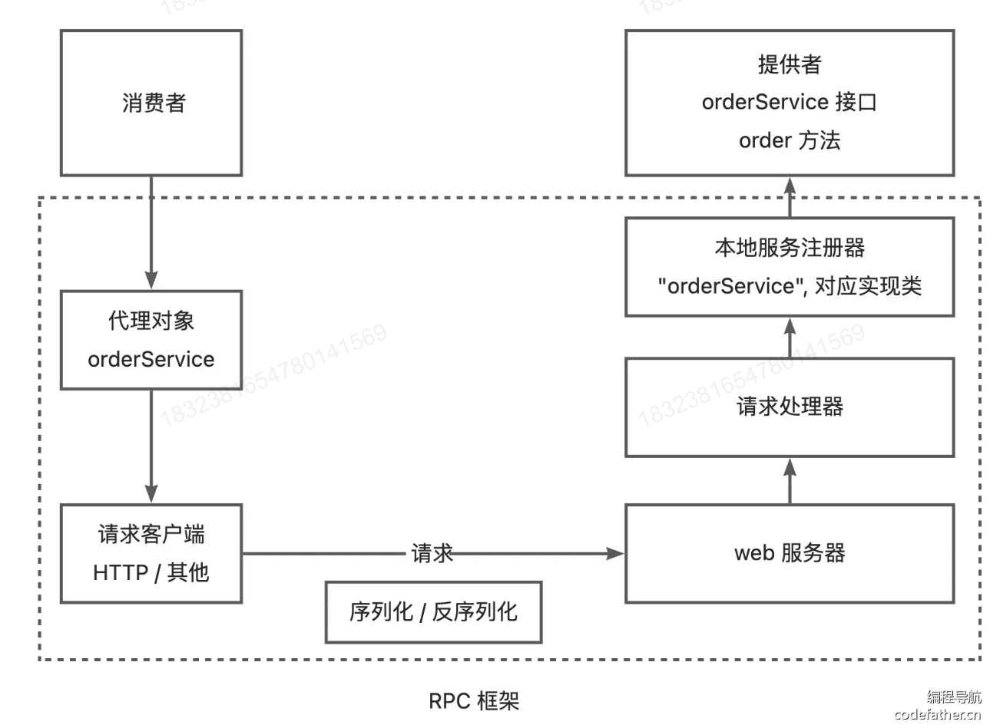

# Demo-RPC Project

## What is RPC?

RPC (Remote Procedure Call) 远程过程调用, 是一种计算机通信协议, 允许程序在不同计算机之间通信和交互, 就像本地调用一样.

## Basic Construction of RPC

**Consumer / Provider Model**: RPC 框架本身不是一个独立运行的服务, 而是一个被 Consumer (调用方) 和 Provider (服务提供方) 集成的代码库. RPC 框架的主要作用是提供透明的远程调用能力, 封装网络通信, 序列化/反序列化等底层细节. 

下面是**当 Consumer 调用 RPC 框架时**，从发起调用到返回结果的完整流程分解：

------

### **1. Consumer 发起调用**

1. 代理对象接收调用：
   - Consumer 在业务代码中调用了一个接口方法（如 `orderService.order()`）。
   - 实际上，这个接口由 RPC 框架生成的**代理对象**（Proxy）实现。
   - 代理对象会捕获方法调用的相关信息，例如方法名、参数类型、参数值等。

------

### **2. 客户端处理请求**

1. **请求封装**：
   - 代理对象将捕获到的方法调用信息打包成一个请求对象，通常包含以下内容：
     - 服务名称（如 `orderService`）。
     - 方法名称（如 `order`）。
     - 方法参数及其值（如 `{"item": "book", "quantity": 2}`）。
   - RPC 框架的客户端模块（request client）负责构造这个请求对象。
2. **序列化**：
   - 请求对象通过框架的序列化工具（如 Protobuf、JSON）转化为二进制格式，以便通过网络传输。
3. **网络发送**：
   - 序列化后的请求通过底层传输协议（如 HTTP、TCP）发送到服务端。
   - 通常会包括：
     - **目标地址**：Provider 的 IP 和端口。
     - **通信协议**：例如 HTTP/2、gRPC 的内部协议。

------

### **3. 服务端接收请求**

1. **请求到达 Web 服务器**：
   - Provider 部署了一个**Web 服务器**（如 Netty 或 Tomcat），监听指定端口，随时准备接收请求。
   - Web 服务器接收到 Consumer 发来的二进制请求数据。
2. **反序列化**：
   - Web 服务器将接收到的数据交给 RPC 框架的服务端模块。
   - 服务端模块对数据进行反序列化，恢复为原始的请求对象（服务名、方法名、参数等）。
3. **请求路由**：
   - 服务端模块根据请求中的**服务名称**（如 `orderService`），通过**服务注册器**查找到对应的服务实现类。
   - 再根据**方法名称**，通过反射调用对应的方法。

------

### **4. 服务端执行逻辑**

1. **方法执行**：
   - 找到对应的服务实现类（如 `OrderServiceImpl`），并执行目标方法（如 `order()`），传入反序列化后的参数。
   - 方法执行完成后返回结果（如 `{"success": true, "orderId": 123}`）。
2. **结果封装与序列化**：
   - 执行结果被封装为一个**响应对象**（response）。
   - 响应对象通过序列化工具转化为二进制格式。
3. **网络回传**：
   - Web 服务器将序列化后的响应通过网络发送回 Consumer。

------

### **5. Consumer 接收结果**

1. **反序列化**：
   - Consumer 的 RPC 框架客户端模块接收到响应数据后，进行反序列化，恢复为原始的返回值对象。
2. **返回给代理对象**：
   - 代理对象接收到反序列化后的结果，将其返回给调用者（Consumer 的业务代码）。
3. **调用完成**：
   - Consumer 的业务代码继续处理返回值，完成远程调用。

------

## **流程图**



# Project Structure (Easy Version)

四个模块 (Maven Project)

## common-example: 

- 规范化的模板 (代码仓库, 不部署在服务器上运行), 给各个开发组件提供规范化的数据类型和接口
- `class User`: 模板数据类
- `interface UserService`: 其中的 `getUser` 方法简易模拟获取用户服务

## provider-example (需引入 common-example & rpc-easy):

- 模拟服务提供者, 这个模块的代码在实际中是要运行在服务器上的
- `class UserServiceImpl`: 作为服务提供者, 它实现了 common-example 中的 `UserService` interface
- `class EasyProviderExample`: provider 的启动类, provider 在启动时要完成如下任务:
  - 把相关服务注册进**本地服务注册器**
  - 启动 **Web 服务器**

## consumer-example (需引入 common-example & rpc-easy):

- 模拟服务消费者, 这个模块也是要实现运行在服务器上的
- `class EasyConsumerExample`: 模拟消费者启动类, 消费者要想使用提供者的方法, 需要使用代理
  - 可以使用 rpc 框架中提供的代理工厂来生成 UserService
  - 也可以在本地写一个静态代理实现类 `UserServiceProxy`
  - 以上两者逻辑类似, 但是显然把代理功能集成进入 rpc 框架会更加高效

## rpc-easy:

在 rpc 框架中, 我们需要解决一下几大子问题:

- server: 使用 Vertx
- registry: 服务注册器
- serializer: 序列化与反序列化
- model: 规范化 RpcRequest 和 RpcResponse 的基本数据结构
- proxy: 动态代理, 方便 consumer 通过代理对象获取需要的方法

以上是基本架构, 具体细节见代码注释. 在简易版本的基础上, 我们逐步增加功能 (rpc-core). 

# server 包和 proxy 包

这两个包是 rpc 框架的核心

proxy 包负责面向 consumer, consumer 通过 ServiceProxy 代理, 获取代理对象, 通过代理对象来调用服务

server 包负责面向 provider, provider 通过 HttpServerHandle 处理收到的 rpc 请求

# Update 1: Self-Defined Rpc Config

显然, 之前的简易版本, 不方便开发者自定义, 例如Rpc服务的地址, 端口号等都是写死的, 所以我们有必要加入配置系统, 允许我们通过写入 `application.porperties` 文件来完成配置.

## 要点

- `com.ypy.rpc.config.RpcConfig`: 该 class 定义配置的基本模式以及默认参数
- `com.ypy.rpc.constant.RpcConstant`: 该 interface 目前只有一个常量, 就是一个配置文件查询前缀 ("rpc"), 即默认情况下, 开发者在 `application.properties` 中应该使用 `rpc.XXX=YYY` 来做配置
- `com.ypy.rpc.utils`: 工具类, 提供读取开发者项目中 `application.properties` 中配置项的方法. 并且其中的 `loadConfig` 方法中的参数使用反射, 使得在开发者在有自定义rpc配置的情况下, 重写 `RpcConfig`这个类
- `com.ypy.rpc.RpcApplication`: 暴露给开发者, 它们使用该类进行 Rpc 初始化
- 消费者和提供者可以在 `application.properties` 中配置 Rpc, 并在项目启动时使用 `RpcApplication.init()` 初始化

# Update 2: Mock Service Proxy

为了给开发者提供测试假数据的功能, 我们添加了 Mock Service Proxy

## 要点

- 在 rpc 框架中的 proxy 添加 `MockServiceProxy` 主要编写生成假数据的逻辑: 例如 对基本数据类型返回默认值, 对Collection类型返回空Collection, 对自定义的 Object 可以递归调用该方法
- 在 `ServiceProxyFactory` 中添加 `getMockFactory` 方法, 并且在 `getProxy()` 中检测开发者的配置文件, 如果有 `rpc.mock=true` 则返回使用 Mock 的 Serivice 对象 (开发者可以使用配置文件全局打开 mock, 也可以单独调用 mock 代理)

# Updata 3.1: Variable Serializers and Self-defined Serializer

框架默认的序列化器是 `JdkSerializer`

框架提供 `JsonSerializer`, `KryoSerializer`, `HessianSerializer` 等三种序列化器, 可以在配置文件中分别使用 `rpc.serializer=json / kryo / hessian` 来启用

核心逻辑是搭建一个 `SerializerFactory` 来维护可用的序列化器, 然后 server 包和 proxy 包中的序列化器就都通过工厂类获得

注意: Hessian 目前除了不了带集合的字段, 因此有时会报错

# Update 3.2: Introduce SPI

之前的升级仅仅是提供了几个内置的序列化器, 但是如果开发者 (consumer & provider) 想自己写序列化器, 并把它引入 rpc 框架, 那应该怎么办呢?

于是就引入了 Java SPI (Service Provider Interface) 机制, 这玩意说白了, 就是允许框架调用者, 自己写一些框架中的类, 并以此代替框架中原有的类. 当然, 这些类必须实现一些接口, 并且要在 resources 中声明.

核心工具类: `SpiLoader` 

- `public static Map<String, Class<?>> load(Class<?> loadClass)` (该方法的返回值并不重要, 关键是它会修改loaderMap)

  加载特定的类 (接口), 也就是参数中的 loadClass. 例如, 我们需要对接口Serializer加载它所有的实现, 该方法会读取项目 resources 目录下特定的文件, 例如 "META-INF/rpc/system/com.ypy.rpc.serializer.Serializer"

- `public static <T> T getInstance(Class<?> tClass, String key)`

  从loaderMap中找到需要使用的类 (接口) 和关键字, 并返回, 例如我们需要 Serializer 借口 + key: json, 这样我们就能够确定具体的实现类了

**对于使用者**:

- 自己实现的序列化器可用放在任意包下. 例如它的路径是 "com.bob.consumer.serializer.BobSerializer"

- 在**自己项目的 resources 目录下**, 建立文件夹及文件: META-INF/rpc/custom/ ypy.com.rpc.serializer.Serializer

  !!!!! 文件名一定要是**框架中相对应借口的类名 (全称) 即: ypy.com.rpc.serializer.Serializer**

- 在 ypy.com.rpc.serializer.Serializer 中, 书写使用者自定义的序列化器实现类, 及其别名, 例如

  ```
  bob=com.bob.consumer.serializer.BobSerializer # 用自己项目中实现类的全名
  ```

**对于框架本身**:

- 框架本身已经提供了四种序列化器, 分别是 jdk, json, kryo, hessian

- 它们的实现类路径在框架中

  ```
  jdk=com.ypy.rpc.serializer.JdkSerializer
  json=com.ypy.rpc.serializer.JsonSerializer
  hessian=com.ypy.rpc.serializer.HessianSerializer
  kryo=com.ypy.rpc.serializer.KryoSerializer
  ```

- 它们的配置文件在META-INF/rpc/system/ ypy.com.rpc.serializer.Serializer, 这个配置文件在**框架的 resources 目录中**

- 如果使用者的序列化器实现类与框架的序列化器重名 (key相同, 例如都叫 json), 那么框架会优先使用用户的实现类, 因为 `String[] SCAN_DIRS = new String[]{RPC_SYSTEM_SPI_DIR, RPC_CUSTOM_SPI_DIR};` 用户的配置被后导入, 会覆盖字典之前插入的键值对