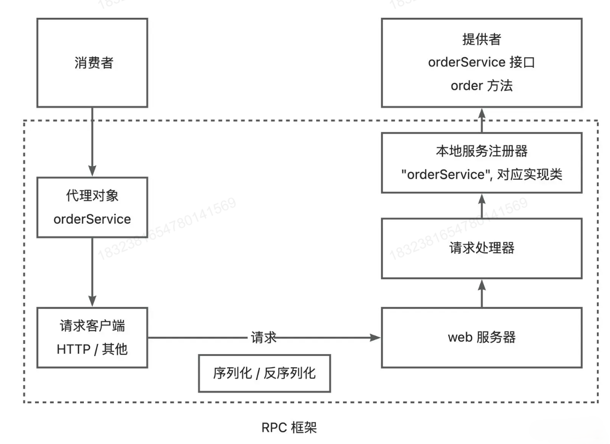

# Demo-RPC Project

## What is RPC?

RPC (Remote Procedure Call) 远程过程调用, 是一种计算机通信协议, 允许程序在不同计算机之间通信和交互, 就像本地调用一样.

## Basic Construction of RPC

**Consumer / Provider Model**: RPC 框架本身不是一个独立运行的服务, 而是一个被 Consumer (调用方) 和 Provider (服务提供方) 集成的代码库. RPC 框架的主要作用是提供透明的远程调用能力, 封装网络通信, 序列化/反序列化等底层细节. 

RPC 完成通信的主要过程为:

### Consumer Part

#### 0. 初始化 RPC 框架

```java
RpcApplication.init()
```

主要是为了读取 Consumer 端开发者的配置信息. 

#### 1. Consumer 发起调用

consumer 使用 "代理工厂对象 (ServiceProxyFactory)" 获取代理服务实现对象, 例如

```java
// com.ypy.consumer.EasyConsumerExample
UserService userService = ServiceProxyFactory.getProxy(UserService.class);
```

然后就可以对 `userService` 像在本地一样调用其中的方法.

#### 2. RPC 框架帮助 Consumer 完成对请求的封装, 发送, 并接受响应

`com.ypy.rpc.proxy.ServiceProxyFactory` 内部封装了 `com.ypy.rpc.proxy.ServiceProxy`, 它是发起 RPC 通信的关键. 

在 **`com.ypy.rpc.proxy.ServiceProxy`** 中, 执行了以下关键内容:

1. 将调用者调用的方法, 传入的参数封装成统一格式的 `RpcRequest rpcRequest`

   ```java
   RpcRequest rpcRequest = RpcRequest.builder() // build request
       .serviceName(method.getDeclaringClass().getName())
       .methodName(method.getName())
       .parameterTypes(method.getParameterTypes())
       .args(args)
       .build();
   ```

2. 使用序列化器序列化 `rpcRequest`

3. 向接受 RPC 请求的 Provider 的地址和端口号 (专门用于处理 RPC 请求的端口) 发送请求

   ```java
   try {
       byte[] bodyBytes = serializer.serialize(rpcRequest); // 序列化器序列化 rpcRequest
       RpcConfig rpcConfig = RpcApplication.getRpcConfig();
       String postUrl = "http://" + rpcConfig.getServerHost() + ":" + rpcConfig.getServerPort();
       try (HttpResponse httpResponse = HttpRequest.post(postUrl) // 发请求
            .body(bodyBytes)
            .execute()) { // .execute() 会在获取请求之前阻塞线程, 这里不是异步编程!
           byte[] result = httpResponse.bodyBytes();
           RpcResponse rpcResponse = serializer.deserialize(result, RpcResponse.class); // deserialize the rpc response
           return rpcResponse.getData();
       }
   } catch (IOException e) {
       e.printStackTrace();
   }
   ```

4. 待获取 RPC 的响应数据后, 反序列化它, 将其转化成 `RpcResponse rpcResponse`, 并抽取其中的数据字段 (这才是 Consummer 真正想拿到的东西)

### Provider Part

#### 0. Provider 的准备工作

1. 初始化 RPC 框架

2. 把自己想提供的服务注册进入 RPC 框架

3. 开启一个服务端口, 专门处理 RPC 请求

   ```java
   public class ProviderExample {
       public static void main(String[] args) {
           RpcApplication.init();
           LocalRegistry.register(UserService.class.getName(), UserServiceImpl.class); 
           LocalRegistry.register(BookService.class.getName(), BookServiceImpl.class);
           HttpServer httpServer = new VertxHttpServer();
           httpServer.doStart(RpcApplication.getRpcConfig().getServerPort());
       }
   }
   ```

#### 1. RPC 框架帮助 Provider 完成对请求的接收, 解析, 并发送响应

RPC 框架帮助 Provider 接受并处理请求的核心逻辑在 `com.ypy.rpc.server` 包中

其中 `com.ypy.rpc.server.VertxHttpServer` 是用来部署处理 RPC 请求的服务器的

`com.ypy.rpc.server.HttpServerHandler` 则是处理请求的关键:

```java
request.bodyHandler(body -> {
    byte[] bytes = body.getBytes();
    RpcRequest rpcRequest = null;
    try {
        rpcRequest = serializer.deserialize(bytes, RpcRequest.class);
    } catch (Exception e) {
        e.printStackTrace();
    }
    RpcResponse rpcResponse = new RpcResponse();

    if (rpcRequest == null) {
        rpcResponse.setMessage("rpcRequest is null");
        doResponse(request, rpcResponse, serializer);
        return;
    }

    try {
        Class<?> implClass = LocalRegistry.get(rpcRequest.getServiceName());
        Method method = implClass.getMethod(rpcRequest.getMethodName(), rpcRequest.getParameterTypes());
        Object result = method.invoke(implClass.newInstance(), rpcRequest.getArgs());
        rpcResponse.setData(result);
        rpcResponse.setDataType(method.getReturnType());
        rpcResponse.setMessage("ok");
    } catch (Exception e) {
        e.printStackTrace();
        rpcResponse.setMessage(e.getMessage());
        rpcResponse.setException(e);
    }
    doResponse(request, rpcResponse, serializer);
});
```

通过异步编程, 当有请求过来时, 解析 -> 调用相应的服务方法 -> 获取方法结果 -> 封装结果 -> 发送响应

### server 包和 proxy 包

不难看出这两个包是 rpc 框架的核心

proxy 包负责面向 consumer, consumer 通过 ServiceProxy 代理, 获取代理对象, 通过代理对象来调用服务

server 包负责面向 provider, provider 通过 HttpServerHandle 处理收到的 rpc 请求

## **Procedure Diagram**



## Project Structure (Easy Version)

四个模块 (Maven Project)

### common-example

- 规范化的模板 (代码仓库, 不部署在服务器上运行), 给各个开发组件提供规范化的数据类型和接口
- `class User`: 模板数据类
- `interface UserService`: 其中的 `getUser` 方法简易模拟获取用户服务

### provider-example (需引入 common-example & rpc-easy)

- 模拟服务提供者, 这个模块的代码在实际中是要运行在服务器上的
- `class UserServiceImpl`: 作为服务提供者, 它实现了 common-example 中的 `UserService` interface
- `class EasyProviderExample`: provider 的启动类, provider 在启动时要完成如下任务:
  - 把相关服务注册进**本地服务注册器**
  - 启动 **Web 服务器**

### consumer-example (需引入 common-example & rpc-easy)

- 模拟服务消费者, 这个模块也是要实现运行在服务器上的
- `class EasyConsumerExample`: 模拟消费者启动类, 消费者要想使用提供者的方法, 需要使用代理
  - 可以使用 rpc 框架中提供的代理工厂来生成 UserService
  - 也可以在本地写一个静态代理实现类 `UserServiceProxy`
  - 以上两者逻辑类似, 但是显然把代理功能集成进入 rpc 框架会更加高效

### rpc-easy

在 rpc 框架中, 我们需要解决以下几大子问题:

- server: 使用 Vertx
- registry: 服务注册器
- serializer: 序列化与反序列化
- model: 规范化 RpcRequest 和 RpcResponse 的基本数据结构
- proxy: 动态代理, 方便 consumer 通过代理对象获取需要的方法

以上是基本架构, 具体细节见代码注释. 在简易版本的基础上, 我们逐步增加功能 (rpc-core). 

## Update 1: Self-Defined Rpc Config

> 显然, 之前的简易版本, 不方便开发者自定义, 例如Rpc服务的地址, 端口号等都是写死的, 所以我们有必要加入配置系统, 允许我们通过写入 `application.porperties` 文件来完成配置.

`com.ypy.rpc.config.RpcConfig`: 该 class 定义配置的基本模式以及默认参数.

`com.ypy.rpc.constant.RpcConstant`: 该 interface 目前只有一个常量, 就是一个配置文件查询前缀 ("rpc"), 即默认情况下, 开发者在 `application.properties` 中应该使用 `rpc.XXX=YYY` 来做配置.

`com.ypy.rpc.utils`: 工具类, 提供读取开发者项目中 `application.properties` 中配置项的方法. 并且其中的 `loadConfig` 方法中的参数使用反射, 使得在开发者在有自定义rpc配置的情况下, 重写 `RpcConfig`这个类.

`com.ypy.rpc.RpcApplication`: 暴露给开发者, 他们使用该类进行 Rpc 初始化, 也就是从配置文件中读取信息. `.init()` 方法在 web 项目的入口执行一次.

消费者和提供者可以在 `resources/application.properties` 中配置 Rpc, 并在项目启动时使用 `RpcApplication.init()` 初始化.

## Update 2: Mock Service Proxy

> 为了给开发者提供测试假数据的功能, 我们添加了 Mock Service Proxy

`com.ypy.rpc.proxy.MockServiceProxy` 主要编写生成假数据的逻辑: 其中的 `getDefaultObject` 方法对基本数据类型返回默认值, 对Collection类型返回空Collection, 对自定义的 Object 可以递归调用该方法.

在 `com.ypy.rpc.proxy.ServiceProxyFactory` 中添加 `getMockFactory` 方法, 并且在 `getProxy()` 中检测开发者的配置文件, 如果有 `rpc.mock=true` 则返回使用 Mock 的 Serivice 对象 (开发者可以使用配置文件全局打开 mock, 也可以单独调用 mock 代理).

使用 Mock 代理的情况下, 就允许 Consumer 开发者在无 Provider 的情况下获得假数据.

## Updata 3.1: Variable Serializers and Self-defined Serializer

> 给开发者提供选择序列化器和自定义序列化器的功能

框架默认的序列化器是 `JdkSerializer`.

框架提供 `JsonSerializer`, `KryoSerializer`, `HessianSerializer` 等三种序列化器实现, 可以在配置文件中分别使用 `rpc.serializer=json / kryo / hessian` 来启用.

核心逻辑是搭建一个 `SerializerFactory` 来维护可用的序列化器.

```java
/**
 * without spi
 */
public class SerializerFactory {
    private static final Map<String, Serializer> KEY_SERIALIZER_MAP = new HashMap<String, Serializer>() {{
        put(SerializerKeys.JDK, new JdkSerializer());
        put(SerializerKeys.JSON, new JsonSerializer());
        put(SerializerKeys.KRYO, new KryoSerializer());
        put(SerializerKeys.HESSIAN, new HessianSerializer());
    }};

    public static final Serializer DEFAULT_SERIALIZER = KEY_SERIALIZER_MAP.get(SerializerKeys.JDK);

    public static Serializer getInstance(String key) { return KEY_SERIALIZER_MAP.get(key); }
}
```

然后 server 包和 proxy 包中的序列化器就都通过工厂类获得:

```java
Serializer serializer = SerializerFactory.getInstance(RpcApplication.getRpcConfig().getSerializer());
```

注意: Hessian 目前除了不了带集合的字段, 因此有时会报错

## Update 3.2: Introduce SPI

> 之前的升级仅仅是提供了可供选择的几个内置的序列化器. 
>
> 但是如果开发者 (Consumer & Provider) 想自己写序列化器, 并把它引入 rpc 框架, 那应该怎么办呢?
>
> 于是就引入了 Java SPI (Service Provider Interface) 机制. 
>
> 这玩意说白了, 就是允许框架调用者, 自己实现一些框架中的接口, 并以此代替框架中原有的接口实现类. 当然, 要在 resources 中声明.

**核心工具类: `com.ypy.rpc.spi.SpiLoader`** 

```java
@Slf4j
public class SpiLoader {
    private static Map<String, Map<String, Class<?>>> loaderMap = new ConcurrentHashMap<>();
    private static Map<String, Object> instanceCache = new ConcurrentHashMap<>();
    private static final String RPC_SYSTEM_SPI_DIR = "META-INF/rpc/system/";
    private static final String RPC_CUSTOM_SPI_DIR = "META-INF/rpc/custom/";
    private static final String[] SCAN_DIRS = new String[]{RPC_SYSTEM_SPI_DIR, RPC_CUSTOM_SPI_DIR};
    private static final List<Class<?>> LOAD_CLASS_LIST = Arrays.asList(Serializer.class);

    public static void loadAll() {
        log.info("load all SPI");
        for (Class<?> clazz : LOAD_CLASS_LIST) load(clazz);
    }
    
    public static Map<String, Class<?>> load(Class<?> loadClass) {
        log.info("load SPI {}", loadClass.getName());
        Map<String, Class<?>> keyClassMap = new HashMap<>();
        for (String scanDir : SCAN_DIRS) {
            List<URL> resources = ResourceUtil.getResources(scanDir + loadClass.getName());
            for (URL resource : resources) {
                try {
                    InputStreamReader inputStreamReader = new InputStreamReader(resource.openStream());
                    BufferedReader bufferedReader = new BufferedReader(inputStreamReader);
                    String line;
                    while ((line = bufferedReader.readLine()) != null) {
                        String[] strs = line.split("=");
                        System.out.println(Arrays.toString(strs));
                        if (strs.length > 1) {
                            String key = strs[0];
                            String className = strs[1];
                            keyClassMap.put(key, Class.forName(className));
                        }
                    }
                } catch (Exception e) {
                    log.error("spi resource load error", e);
                }
            }
        }
        loaderMap.put(loadClass.getName(), keyClassMap);
        return keyClassMap;
    }

    public static <T> T getInstance(Class<?> tClass, String key) {
        String tClassName = tClass.getName();
        Map<String, Class<?>> keyClassMap = loaderMap.get(tClassName);
        if (keyClassMap == null) throw new RuntimeException(String.format("SpiLoader hasn't load %s type", tClassName));
        if (!keyClassMap.containsKey(key)) throw new RuntimeException(String.format("SpiLoader's %s don't have key=%s type", tClassName, key));

        Class<?> implClass = keyClassMap.get(key);
        String implClassName = implClass.getName();
        if (!instanceCache.containsKey(implClassName)) {
            try {
                instanceCache.put(implClassName, implClass.newInstance());
            } catch (InstantiationException | IllegalAccessException e) {
                String errorMsg = String.format("SpiLoader has failed to make instance of %s type", tClassName);
                throw new RuntimeException(errorMsg, e);
            }
        }
        return (T) instanceCache.get(implClassName);
    }
}
```

`private static final String RPC_SYSTEM_SPI_DIR = "META-INF/rpc/system/"; private static final String RPC_CUSTOM_SPI_DIR = "META-INF/rpc/custom/";`: 检查开发者标记自定义实现类所在位置的目录地址. 

- 对于使用者:

  - 自己实现的序列化器可用放在任意包下. 例如它的路径是 "com.bob.consumer.serializer.BobSerializer"

  - 在**自己项目的 resources 目录下**, 建立文件夹及文件: META-INF/rpc/custom/ ypy.com.rpc.serializer.Serializer

    !!!!! 文件名一定要是**框架中相对应接口的类名 (全称) 即: ypy.com.rpc.serializer.Serializer**

  - 在 ypy.com.rpc.serializer.Serializer 中, 书写使用者自定义的序列化器实现类, 及其别名, 例如

    ```
    bob=com.bob.consumer.serializer.BobSerializer # 用自己项目中实现类的全名
    ```

- 对于框架本身:
  - 框架本身已经提供了四种序列化器, 分别是 jdk, json, kryo, hessian

  - 它们的实现类路径在框架中

    ```
    jdk=com.ypy.rpc.serializer.JdkSerializer
    json=com.ypy.rpc.serializer.JsonSerializer
    hessian=com.ypy.rpc.serializer.HessianSerializer
    kryo=com.ypy.rpc.serializer.KryoSerializer
    ```

  - 它们的配置文件在META-INF/rpc/system/ ypy.com.rpc.serializer.Serializer, 这个配置文件在**框架的 resources 目录中**

  - 如果使用者的序列化器实现类与框架的序列化器重名 (key相同, 例如都叫 json), 那么框架会优先使用用户的实现类, 因为 `String[] SCAN_DIRS = new String[]{RPC_SYSTEM_SPI_DIR, RPC_CUSTOM_SPI_DIR};` 用户的配置被后导入, 会覆盖字典之前插入的键值对

`public static Map<String, Class<?>> load(Class<?> loadClass)` (该方法的返回值并不重要, 关键是它会修改`loaderMap`):  加载特定接口 (`loadClass`) 的实现类信息. 例如, 我们需要对接口Serializer加载它所有的实现, 该方法会读取项目 resources 目录下特定的文件 `META-INF/rpc/system/com.ypy.rpc.serializer.Serializer` 中的配置信息, 并把读取到的实现类信息加入进 `loaderMap`.

`public static <T> T getInstance(Class<?> tClass, String key)`: 通过接口名和关键字从loaderMap中找到需要使用的implClass.class. 再通过 implClassName 在 instanceCache 中查找并返回 (或者创建并返回). 例如我们需要 Serializer 接口 + key: json, 这样我们就能够确定具体的实现类了.

**注意**

不同的序列化器序列化出来的结果格式是不同的, 它们可以解析的格式也是不同的, 所以, consumer 和 provider 之间必须协商好**使用同一种序列化器**

**实践**

本 rpc 框架默认实现的 hessian 序列化器是无法处理 List 等集合类字段的, 我们为模拟 consumer 和 provider 提供一套可以实现处理结合类字段的hessian序列化器, 并且使用它覆盖框架提供的 hessian 以验证 SPI 机制. 

为了方便, 自定义的 hessian 序列化器实现在 common 模块中, 然后在 consumer 和 provider 模块中分别创建 `resources/META-INF/custom/com.ypy.rpc.serializer.Serializer`, 在文件中写入 `hessian=ypy.common.serializer.HessianSerializer`, 最后在 `application.properties` 中写入 `rpc.serializer=hessian`

这样设定是合理的, 在项目构建时, 把整个项目的规范放在 common 模块中, 其中也包括一起使用的序列化器实现, 这样有利于规范化项目. 